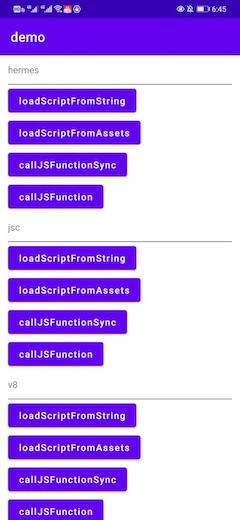

### android-js-engine

android javascript interface, support V8, JSC and Hermes.

### How to run

1. install js engine npm package

```
npm install

```

2. build and run demo app

```
./gradlew :demo:installDebug
```

### Features

* general javascript interface, support different js engine:V8, JSC and Hermes

```java
// hermes
bridge.initialize(new HermesRuntime());
// jsc
// bridge.initialize(new JSCRuntime());
// v8
// bridge.initialize(new V8Runtime());
```

* load string js code
  
```java
  String js = readJSFromAssets();
  bridge.loadScriptFromString(js);
````

* load assets js file

```java
  bridge.loadScriptFromAssets(getAssets(), "assets://app.js");
```

* call js function sync

```java
  List<Object> args = new ArrayList<>();
  args.add("arg1");
  args.add("arg2");
  Object result = bridge.callJSFunctionSync("myfunctionSync", args);
  if (result instanceof Map) {
     Log.d(TAG, ((Map) result).keySet().toString());
  }
```

* call js function async


```java
    List<String> args = new ArrayList<>();
    args.add("1");
    args.add("2");
    bridge.callJSFunction("myfunction", args, new JSCallback() {
          @Override
          public void invoke(Object object) {
                if (object instanceof String) {
                    Log.d(TAG, object.toString());
                 } else if (object instanceof Map) {
                    Log.d(TAG, ((Map) object).keySet().toString());
                 }
             }
     });
```

### Demo snapshot




